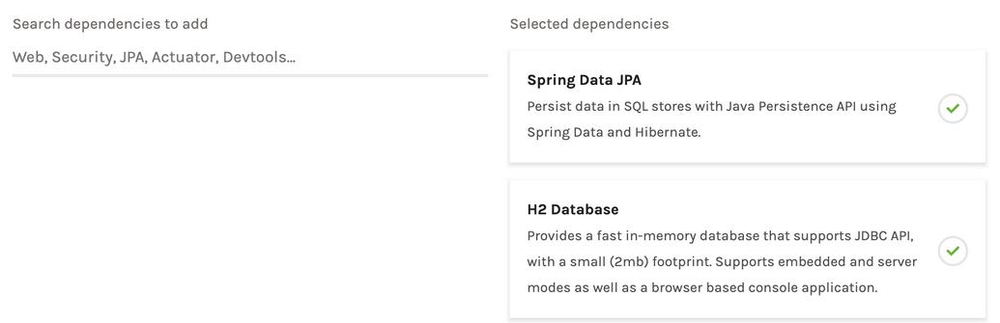

# Spring Data

## What is Spring Data
TODO

## How to use
### Select Data Access Technology
Supported Technologies include:
* JPA, Hibernate, JDBC, SQL
* No-SQL (MongoDB, Neo4J, LDAP, etc.)
* Indicies (ElasticSearch, Solr)
* Cloud (AWS, CloudFoundy, etc.)
* Visit [https://spring.io/projects/spring-data](https://spring.io/projects/spring-data) for many more

### Adding dependencies
#### Manual
Find the required dependencies based on the selected technology. As an example, we use JPA with Hibernate [https://docs.spring.io/spring-data/data-jpa/docs/2.2.1.RELEASE/reference/html/#reference](https://docs.spring.io/spring-data/data-jpa/docs/2.2.1.RELEASE/reference/html/#reference):
```xml
<dependencies>
  <dependency>
    <groupId>org.springframework.data</groupId>
    <artifactId>spring-data-jpa</artifactId>
    <version>2.1.0.RELEASE</version>
  </dependency>
  <dependency>
     <groupId>org.hibernate</groupId>
     <artifactId>hibernate-entitymanager</artifactId>
     <version>5.3.7.Final</version>
 </dependency>
 <dependency>
     <groupId>com.h2database</groupId>
     <artifactId>h2</artifactId>
     <version>1.4.197</version>
 </dependency>
<dependencies>
```
#### Spring Initializr
Alternatively  you could also add `Sprint Data JPA` and `H2 Database` using [Spring Initializr](https://start.spring.io/)

### Manual Configuration
If you're not using SpringBoot or Spring Initializr:\
Annotate your configuration class with
```java
@EnableJpaRepositories( basePackages = "{your-repository-pagacke}" )
```
and add the following methods
```java
@Bean
public DataSource dataSource() {
    return new EmbeddedDatabaseBuilder().setType(EmbeddedDatabaseType.H2).build();
}
@Bean
public JpaVendorAdapter jpaVendorAdapter() {
    HibernateJpaVendorAdapter bean = new HibernateJpaVendorAdapter();
    bean.setDatabase(Database.H2);
    bean.setGenerateDdl(true);
    return bean;
}
@Bean
public LocalContainerEntityManagerFactoryBean entityManagerFactory(DataSource dataSource,
        JpaVendorAdapter jpaVendorAdapter) {
    LocalContainerEntityManagerFactoryBean bean = new LocalContainerEntityManagerFactoryBean();
    bean.setDataSource(dataSource);
    bean.setJpaVendorAdapter(jpaVendorAdapter);
    bean.setPackagesToScan("{your-models-package}");
    return bean;
}
@Bean
public JpaTransactionManager transactionManager(EntityManagerFactory emf) {
    return new JpaTransactionManager(emf);
}
```

### Entities
Annotate classes with `@Entity` and add an id field (Number or String) with @Id.
The id can also be annotated with @GeneratedValue to indicate that the ID should be generated automatically.
The default constructor is required for JPA, but can be made protected if not needed. \
Depending on the selected technology, the Annotation can slighly differ (e.g. `@Document` insted of `@Entity` for MongoDB)
```java
@Entity
public class EntityClass {
    @Id
    @GeneratedValue(strategy=GenerationType.AUTO)
    private Long id;

    protected EntityClass(){}
}
```

### Repository with Queries
Spring Data is able to create the repository and quiery implementations automatically. Only the definition of an Interface is required with the desired quiery methods. The query implementations are generated based on the method name. Visit [https://docs.spring.io/spring-data/jpa/docs/current/reference/html/#jpa.query-methods.query-creation](https://docs.spring.io/spring-data/jpa/docs/current/reference/html/#jpa.query-methods.query-creation) for the query syntax.

> Note:  `CrudRepository` may need to be replaced for different technologies (e.g. `MongoRepository` for MongoDB)

```java
public interface CustomerRepository extends CrudRepository<EntityClass, Long /*type of id*/> {
    // Queries
    List<Customer> findByLastName(String lastName);
    Customer findById(Long /*type of id*/ id);
}
```
## Authors
* Joel Studler [joel.studler@students.bfh.ch](joel.studler@students.bfh.ch)
* Fabian Wittwer [fabian.wittwer@students.bfh.ch](fabian.wittwer@students.bfh.ch)

## Links
* Project Page [https://spring.io/projects/spring-data](https://spring.io/projects/spring-data)
* Getting Started Guide [https://spring.io/guides/gs/accessing-data-jpa/](https://spring.io/guides/gs/accessing-data-jpa/)
* Reference Manual [https://docs.spring.io/spring-data/data-jpa/docs/2.2.1.RELEASE/reference/html/#reference](https://docs.spring.io/spring-data/data-jpa/docs/2.2.1.RELEASE/reference/html/#reference)
* Query Syntax [https://docs.spring.io/spring-data/jpa/docs/current/reference/html/#jpa.query-methods.query-creation](https://docs.spring.io/spring-data/jpa/docs/current/reference/html/#jpa.query-methods.query-creation)
* Spring Initializr [https://start.spring.io/](https://start.spring.io/)
